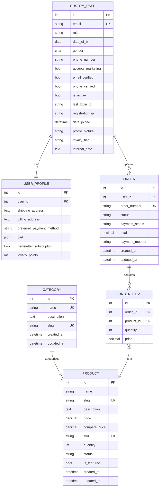

# E-Commerce API - Database Entity Relationship Diagram

## Complete System ERD

### Mermaid Interactive Diagram

### Full Detailed Diagram

## Database Schema Overview

This ERD represents the complete database structure for the E-Commerce API application, showing all entities, their attributes, and relationships.

## Key Database Features

### 1. **User Management**
- **CUSTOM_USER**: Extended user model with authentication and profile data
- **USER_PROFILE**: Additional user information and preferences

### 2. **Product Management**
- **CATEGORY**: Product categorization system
- **PRODUCT**: Comprehensive product information with inventory tracking

### 3. **Order Management**
- **ORDER**: Customer order information and status tracking
- **ORDER_ITEM**: Individual items within orders with pricing

### 4. **Relationships**
- One-to-One: User ↔ UserProfile
- One-to-Many: User → Orders, Category → Products, Order → OrderItems
- Many-to-One: OrderItems → Product

## Database Tables Summary

| Table | Purpose | Key Features |
|-------|---------|--------------|
| `custom_user` | User authentication | Email, role, verification status |
| `user_profile` | Extended user data | Addresses, preferences, loyalty |
| `category` | Product categories | Hierarchical organization |
| `product` | Product information | Pricing, inventory, variants |
| `order` | Customer orders | Status tracking, payment info |
| `order_item` | Order line items | Quantity, price at time of order |

## Data Integrity
- Unique constraints prevent duplicate entries
- Foreign key relationships maintain referential integrity
- Validation ensures data consistency across related tables

This ERD provides a comprehensive view of the e-commerce database structure, supporting all major features including user management, product catalog, and order processing.